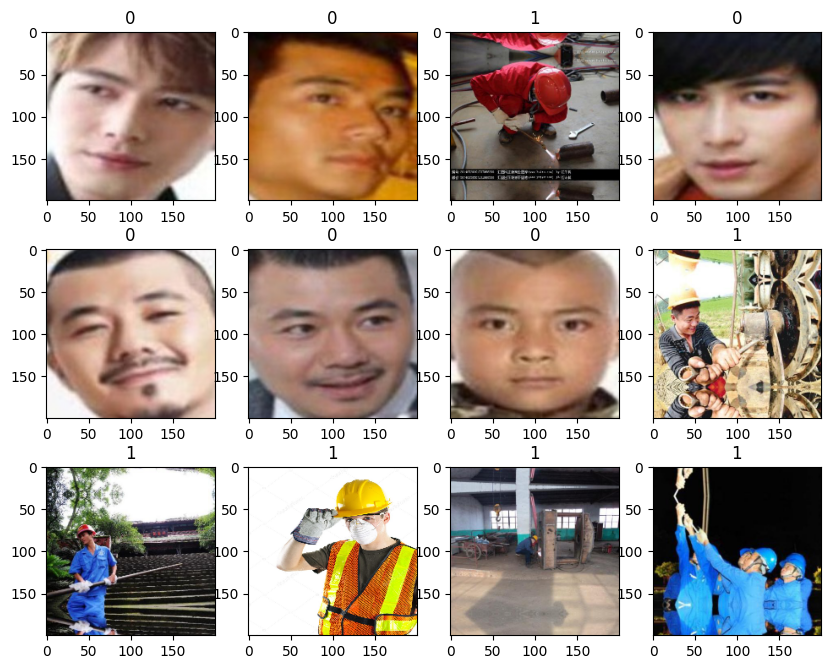
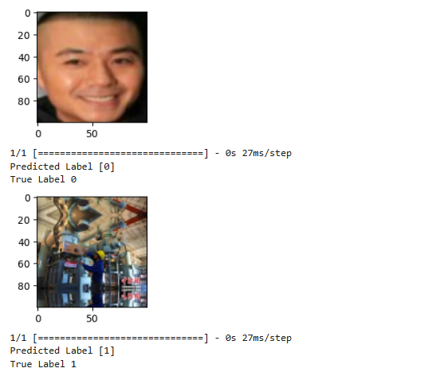
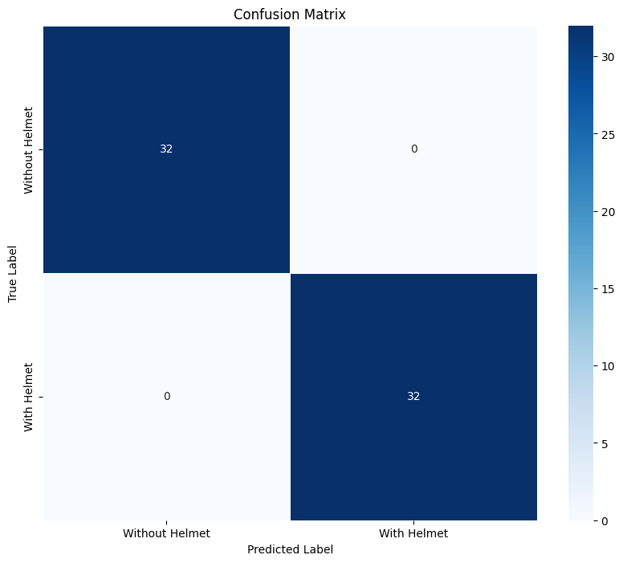
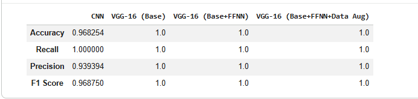

# ⛑ HelmetSense - Helmet Detection System

## 📌 Project Description
HelmetSense is a system designed to detect whether a person is wearing a helmet using image processing / machine learning techniques.

---

## ✨ Features
- Image-based helmet detection
- CNN model for classification
- Transfer learning using VGG16
- Data augmentation for better performance
- Performance evaluation using multiple metrics

---

## 📸 Screenshots

### 🖼️ Input Image


### 🧠 Prediction Output


### 📊 Confusion Matrix


### 📈 Training Performance


---

## 🛠️ Tech Stack
- Python
- NumPy
- Pandas
- Matplotlib
- Seaborn
- OpenCV (cv2)
- TensorFlow
- Keras (Sequential + Functional API)
- Scikit-learn

---

## 📊 Project Workflow
1. Load and preprocess image dataset
2. Apply data augmentation using ImageDataGenerator
3. Build CNN model with VGG16
4. Train model using training data
5. Evaluate model using classification metrics
6. Predict helmet detection on images

---

## 📈 Output
The system identifies whether a helmet is present and displays the result visually.

---

## ⚙️ Installation & Setup
```bash
git clone https://github.com/nayanasharma7124/HelmetSense
cd HelmetSense
pip install -r requirements.txt
jupyter notebook
